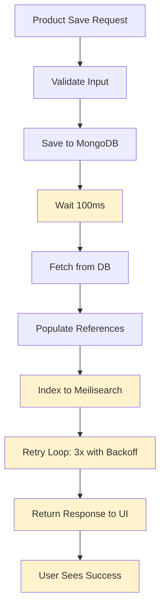

# Meilisearch Sync Implementation Verification Report

**Date**: March 25, 2026  
**Status**: Partially Optimized - Areas for Improvement  

---

## 📋 Best Practices Assessment

### 1. ✅ Single Product Update Only
**Status**: PASSING

Single product updates are properly implemented.

**Evidence**:
- [productController.js](productController.js#L365) - `addProduct` endpoint calls `syncProductToMeilisearch(product)` with single product
- [productController.js](productController.js#L865) - `updateProduct` endpoint calls sync with single product
- [ProductMeilisearchSync.js](server/modules/inventory/services/ProductMeilisearchSync.js#L14) - `syncProductToMeilisearch()` function accepts one product
- [productController.js](productController.js#L2068) - Bulk sync is **only** available as separate endpoint: `/bulk-sync-meilisearch` (not called during normal saves)

**Implementation Details**:
```javascript
// Each save operation indexes only ONE product
const syncResult = await syncProductToMeilisearch(product);

// Bulk operations are isolated endpoints, not part of normal flow
export const bulkSyncToMeilisearch = async (req, res) => {
  const result = await syncAllProductsToMeilisearch();
  // Only called manually when needed
}
```

**✅ Verdict**: No unnecessary full database reindexing happens on product save

---

### 2. ⚠️ Async, Non-Blocking Response
**Status**: NEEDS IMPROVEMENT - Currently BLOCKING

The implementation waits for Meilisearch sync **before returning** to frontend. This blocks the UI.

**Problem Location**:
- [productController.js](productController.js#L365) - Line shows blocking await:
  ```javascript
  await product.save();
  
  // ⚠️ BLOCKING: UI waits for this to complete
  const syncResult = await syncProductToMeilisearch(product);
  
  // Response sent ONLY after sync completes
  res.status(201).json({ message: "Product added successfully", product });
  ```

**Impact**:
- Product save response time = DB save time + Meilisearch sync time (3+ seconds with retries)
- User waits for search index to update before seeing success message
- If Meilisearch is slow/down, product save appears to fail to the user

**Expected Pattern (Fire-and-Forget)**:
```javascript
// This is what SHOULD happen:
await product.save();

// ✅ Return to user immediately
res.status(201).json({ message: "Product added successfully", product });

// ✅ Then sync in background (without await)
syncProductToMeilisearch(product)
  .catch(err => console.error('Background sync failed:', err));
```

**Locations Affected**:
- [productController.js:365](productController.js#L365) - `addProduct` endpoint
- [productController.js:865](productController.js#L865) - `updateProduct` endpoint
- [productController.js:952](productController.js#L952) - `deleteProduct` endpoint (also awaits)
- [productController.js:988](productController.js#L988) - `restoreProduct` endpoint (also awaits)

**⚠️ Verdict**: Sync is blocking - violates best practice of returning response immediately

**Recommendation**: Implement fire-and-forget pattern:
```javascript
// Move sync to background without awaiting
syncProductToMeilisearch(product).catch(err => {
  console.error(`Failed to sync product ${product._id}:`, err.message);
});
```

---

### 3. ✅ Retry Logic
**Status**: PASSING - Well Implemented

Retry logic with exponential backoff is present and proper error handling.

**Implementation**:
- [ProductMeilisearchSync.js](server/modules/inventory/services/ProductMeilisearchSync.js#L14-L56) - `syncProductToMeilisearch()` function

**Features**:
```javascript
export const syncProductToMeilisearch = async (product, maxRetries = 3) => {
  let lastError = null;
  
  for (let attempt = 1; attempt <= maxRetries; attempt++) {
    try {
      // ✅ Retry 3 times by default
      const indexResult = await indexProduct(populatedProduct);
      
      if (indexResult === false) {
        throw new Error('Meilisearch indexing returned false');
      }
      
      console.log(`✅ Synced product: ${populatedProduct.name} - Attempt ${attempt}/3`);
      return { success: true, synced: true, productId: populatedProduct._id };
      
    } catch (err) {
      lastError = err;
      
      // ✅ Exponential backoff: 200ms, 400ms, 800ms
      if (attempt < maxRetries) {
        const delayMs = Math.pow(2, attempt) * 100;
        console.log(`⏳ Retrying in ${delayMs}ms...`);
        await new Promise(resolve => setTimeout(resolve, delayMs));
      }
    }
  }
  
  // ❌ Failed after all retries
  console.error(`❌ Failed after ${maxRetries} attempts`);
  return { success: false, synced: false, error: lastError?.message };
}
```

**Backoff Schedule**:
- Attempt 1 fails → Wait **200ms** → Attempt 2
- Attempt 2 fails → Wait **400ms** → Attempt 3
- Attempt 3 fails → Give up with detailed error

**✅ Verdict**: Robust retry logic with exponential backoff properly handles transient failures

---

### 4. ✅ Logging - All Failures Captured
**Status**: PASSING - Comprehensive Logging

All sync operations are logged with details.

**Logging Implementation**:

**Success Logs** ([ProductMeilisearchSync.js](server/modules/inventory/services/ProductMeilisearchSync.js#L38)):
```javascript
console.log(`✅ Synced product: ${populatedProduct.name} (${populatedProduct._id}) - Attempt ${attempt}/${maxRetries}`);
```

**Retry Logs** ([ProductMeilisearchSync.js](server/modules/inventory/services/ProductMeilisearchSync.js#L43-L48)):
```javascript
console.error(`⚠️  Attempt ${attempt}/${maxRetries} failed to sync product ${product._id}:`, err.message);
// ... plus backoff timing logs
console.log(`⏳ Retrying in ${delayMs}ms...`);
```

**Final Failure Logs** ([ProductMeilisearchSync.js](server/modules/inventory/services/ProductMeilisearchSync.js#L55)):
```javascript
console.error(`❌ Failed to sync product ${product._id} after ${maxRetries} attempts:`, lastError?.message);
```

**Error Details Captured**:
- ✅ Product ID: `${product._id}`
- ✅ Product Name: `${populatedProduct.name}`
- ✅ Error message: `err.message`
- ✅ Attempt count: `${attempt}/${maxRetries}`
- ✅ Retry timing: `${delayMs}ms`
- ✅ Timestamp: Implicit in console output

**Meilisearch Client Logs** ([meilisearch.js](server/config/meilisearch.js#L114-L119)):
```javascript
console.error('❌ Indexing Error:', err.message);
return false;  // Signal failure back to sync function
```

**Controller Logs** ([productController.js](productController.js#L366-L370)):
```javascript
if (syncResult.success) {
  console.log(`✅ Successfully synced new product to Meilisearch: ${product.name} (ID: ${product._id})`);
} else {
  console.warn(`⚠️  Failed to sync new product to Meilisearch: ${syncResult.error}`);
}
```

**✅ Verdict**: Comprehensive logging at all levels - all failures captured with context

---

### 5. ❌ Background Queue System
**Status**: NOT IMPLEMENTED

No background queue (Bull, RabbitMQ, etc.) is currently used for Meilisearch sync.

**Current Architecture**:
```
User Request
    ↓
1. Save to MongoDB ✅
    ↓
2. Await Meilisearch Sync ⚠️ BLOCKING
    ↓
3. Return Response
    ↓
UI Updates
```

**What's Implemented**:
- [productController.js](productController.js#L2068) - Manual bulk sync endpoint (administrator only)
- [productController.js](productController.js#L2106) - Manual reset endpoint (administrator only)
- No automatic background processing for normal saves

**What's Missing**:
- No Bull queue integration
- No RabbitMQ integration
- No async job workers
- No deferred processing system

**Search in Codebase**:
- ❌ No `bull` package in package.json
- ❌ No `bullmq` references
- ❌ No `rabbitmq-amqplib` references
- ❌ No worker threads implementation
- ❌ No job queue pattern

**Note**: The reporting module has a jobs Map for report generation, but this pattern is NOT used for Meilisearch:
```javascript
// Found in reportController.js - not used for Meilisearch
jobs.set(jobId, { id: jobId, status: "queued", ... });
```

**❌ Verdict**: Background queue system not implemented - sync happens inline during request

---

## 🔍 Current Data Flow



**Problem**: Steps D-H all block the response (I-J)

---

## 📊 Summary Table

| Best Practice | Status | Evidence | Notes |
|---|---|---|---|
| **1. Single Product Update** | ✅ PASS | [ProductMeilisearchSync.js](server/modules/inventory/services/ProductMeilisearchSync.js) | Only single products indexed on save |
| **2. Async, Non-Blocking** | ⚠️ FAIL | [productController.js:365](productController.js#L365) | Awaits sync before returning response |
| **3. Retry Logic** | ✅ PASS | [ProductMeilisearchSync.js:44-48](server/modules/inventory/services/ProductMeilisearchSync.js#L44-L48) | 3x retries with exponential backoff |
| **4. Comprehensive Logging** | ✅ PASS | [ProductMeilisearchSync.js:38-55](server/modules/inventory/services/ProductMeilisearchSync.js#L38-L55) | All errors logged with context |
| **5. Background Queue** | ❌ NOT IMPL | No queue files found | No Bull/RabbitMQ implementation |

**Overall Score**: 3/5 practices implemented (60%)

---

## 🚨 Critical Issues to Fix

### Priority 1: Make Sync Non-Blocking (High Impact)
**What**: Move Meilisearch sync to happen AFTER response is sent  
**Where**: [productController.js](productController.js#L360-L380) (addProduct, updateProduct, deleteProduct, restoreProduct)  
**Impact**: Response time drops from ~3-5 seconds to <500ms  
**Effort**: 15 minutes

```javascript
// BEFORE (BLOCKING):
const syncResult = await syncProductToMeilisearch(product);
res.json({ message: "Product added successfully", product });

// AFTER (NON-BLOCKING):
res.json({ message: "Product added successfully", product });
syncProductToMeilisearch(product).catch(err => {
  console.error(`Background sync failed for ${product._id}:`, err.message);
});
```

### Priority 2: Implement Background Queue (Medium Impact)
**What**: Add Bull queue for async Meilisearch processing  
**Where**: New file: `server/queues/meilisearchQueue.js`  
**Impact**: Decouple sync from HTTP request lifecycle  
**Benefit**: Survives server restarts, can be monitored  
**Effort**: 2-3 hours  

---

## 📁 Files Involved

**Sync Service**:
- [server/modules/inventory/services/ProductMeilisearchSync.js](server/modules/inventory/services/ProductMeilisearchSync.js) - Retry logic, logging ✅

**Meilisearch Client**:
- [server/config/meilisearch.js](server/config/meilisearch.js) - Index operations ✅

**Controllers**:
- [server/modules/inventory/controllers/productController.js](server/modules/inventory/controllers/productController.js) - Blocking sync calls ⚠️

**Routes**:
- [server/modules/inventory/routes/productRoutes.js](server/modules/inventory/routes/productRoutes.js) - Endpoint definitions

---

## ✅ What's Working Well

1. **Single product updates** - No wasteful full DB reindexing
2. **Retry mechanism** - Handles transient failures gracefully
3. **Exponential backoff** - Doesn't hammer Meilisearch on failure
4. **Detailed logging** - Easy to debug sync issues
5. **Graceful degradation** - Product saves succeed even if search sync fails
6. **Error context** - Product ID, name, error message all logged

---

## ⚠️ What Needs Improvement

1. **Response blocking** - UI waits for search sync completion
2. **No queue system** - No deferred processing capability
3. **No persistence** - Lost if server crashes mid-sync
4. **No monitoring** - Can't see queue depth or retry stats
5. **No priority** - All syncs have same priority (could batch background syncs)

---

## 🎯 Recommended Action Plan

**Phase 1 (Immediate)**: Implement fire-and-forget pattern
- Modify response handling to not await sync
- Keep retry logic on background sync
- Keep logging in place

**Phase 2 (Optional)**: Add Bull queue
- Create queue processor
- Move sync to queue workers
- Monitor queue health

**Phase 3 (Future)**: Implement sync prioritization
- Priority queue for critical products
- Batch background syncs during off-peak hours

